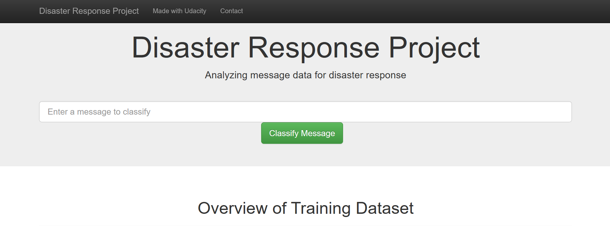
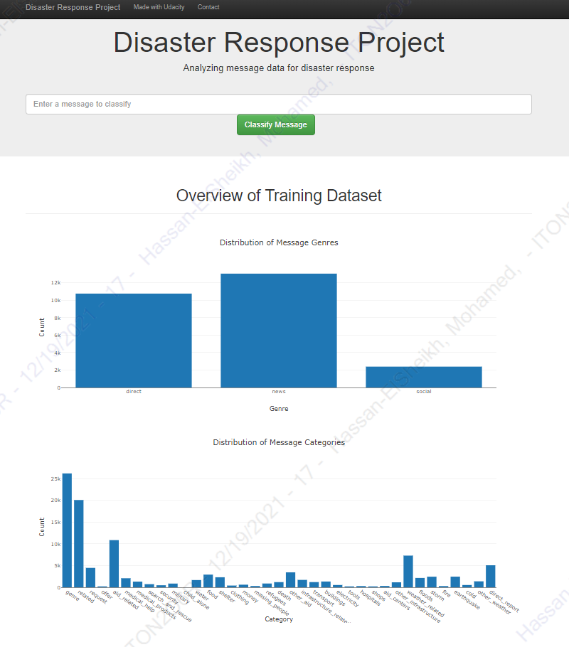
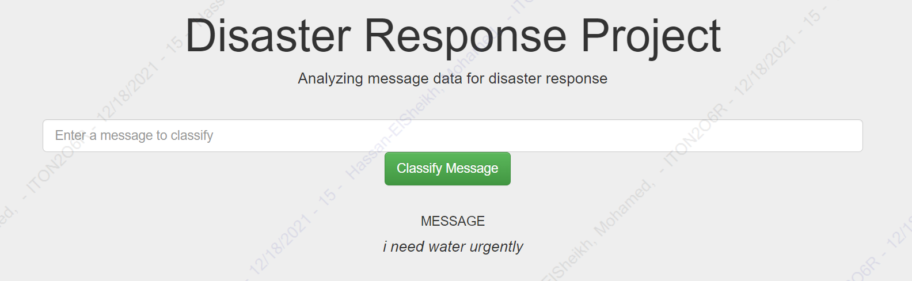
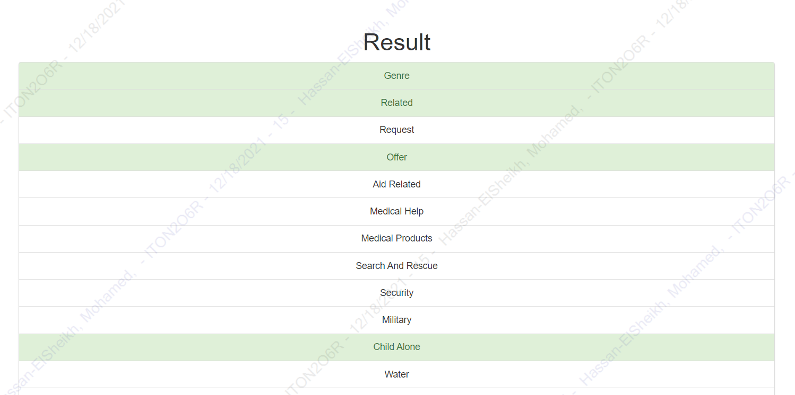

# Disaster_Response_Pipeline

## Description

We will create a model to classify messages sent during disasters in this project. Aid-related, medical assistance, search-and-rescue, and other categories are among the 36 pre-defined categories. We can classify these messages and send them to the relevant disaster assistance agency by classifying them. To make the process easier, this project will include the creation of a simple ETL and Machine Learning pipeline. Because a message can belong to one or more categories, this is also a multi-label classification task. We'll be using a data collection given by [Figure Eight](https://www.figure-eight.com/) that includes genuine texts sent during disasters.

Finally, this project includes a web application that allows you to enter a message and receive classification results.

## Files
        disaster_response_pipeline
          |-- app
                |-- templates
                        |-- go.html
                        |-- master.html
                |-- run.py
          |-- data
                |-- ETL Pipeline Preparation.ipynb
                |-- disaster_message.csv
                |-- disaster_categories.csv
                |-- InsertDadabaseName.db
                |-- process_data.py
          |-- models
                |-- train_classifier.py
          |-- snaps
                |-- WebAppScreen.png

          |-- README
          |-- License

## Descriptions
1. App folder including the templates folder and "run.py" for the web application
2. Data folder containing "InsertDadabaseName.db", "disaster_categories.csv", "disaster_messages.csv" and "process_data.py" for data cleaning and transfering.
3. Models folder including "classifier.pkl" and "train_classifier.py" for the Machine Learning model.
4. snaps folder for web app snapshot
5. README file
6. License file

## Instructions
1. Run the following commands in the project's root directory to set up your database and model.

    - To run ETL pipeline that cleans data and stores in database
        `python data/process_data.py data/disaster_messages.csv data/disaster_categories.csv data/InsertDadabaseName.db`
        
    - To run ML pipeline that trains classifier and saves
        `python models/train_classifier.py data/InsertDadabaseName.db models/classifier.pkl`

2. Run the following command in the app's directory to run your web app.
    `python run.py`

3. Go to http://0.0.0.0:3001/

## Snaps

1. Some graphs concerning the training dataset may be found on the main page.

2. This is an example of a message we may use to test the model's performance.

3. We can see the categories to which the message belongs highlighted in green after clicking **Classify Message**.

